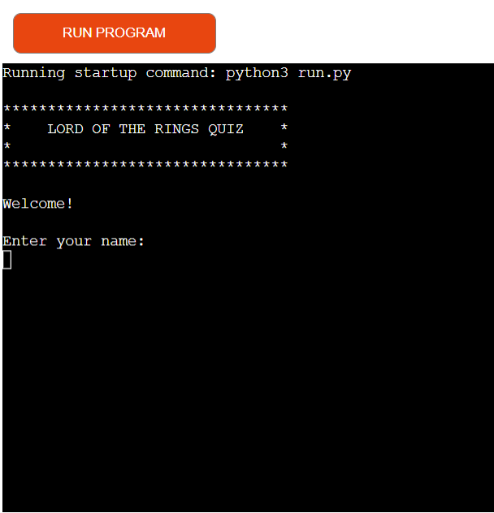
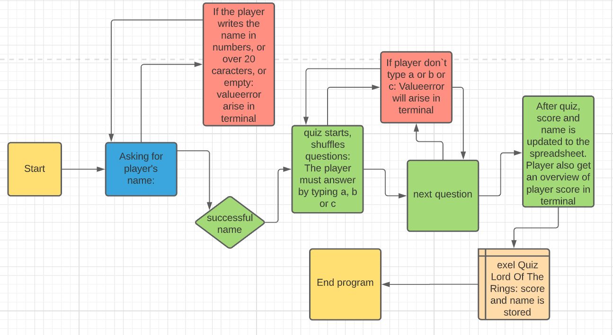
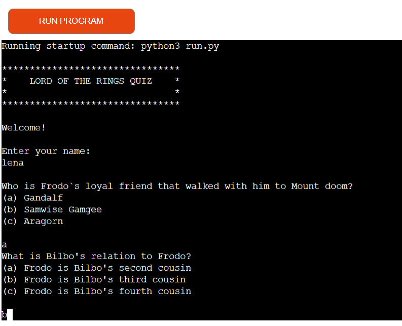
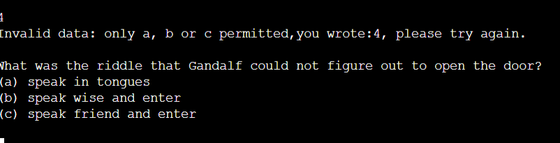
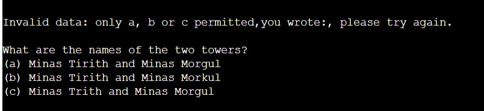
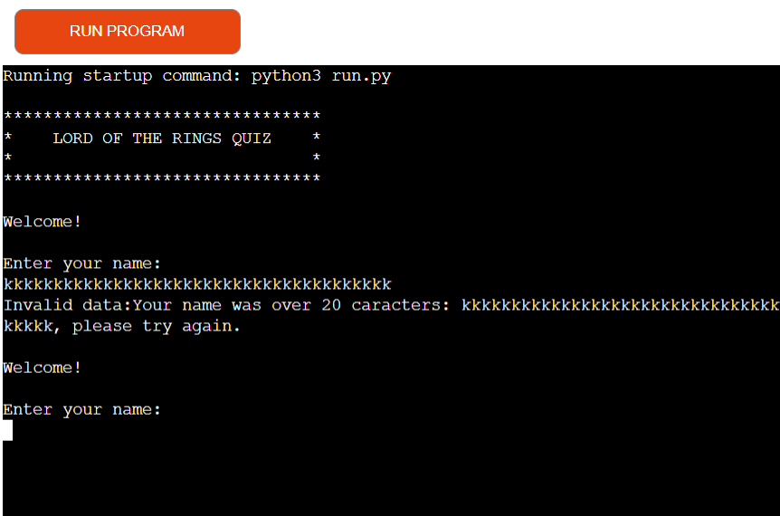
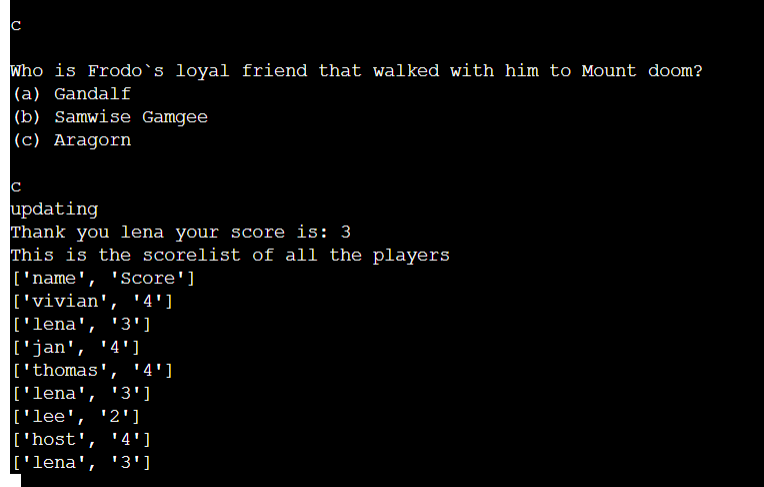
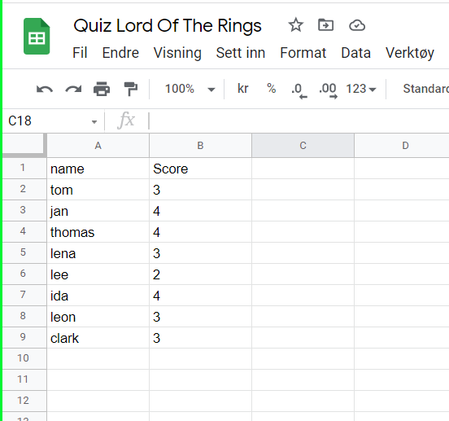
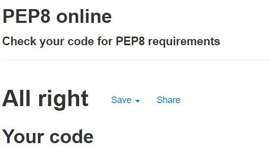

# Welcome To The Lord of The Rings Mock Terminal Python Quiz

This quiz will check the players knowledge about the lord of the rings triology. It contains ten questions that are randomed shuffled each time a user is playing. It can be a nice quiz to be used with friends or be used as a fun activity, that can be done with colleges. The quiz master/ owner can use the spreadsheet, to get an overview of the players names and scores.

Visit the quiz game here: https://lord-of-the-ringsquiz.herokuapp.com/

### How to play the quiz game
* First the quiz game will ask for you name. The quiz starts if the name is correctly typed. The name can not be empty or in numbers.
* The player will be asked one question at a time, and the player needs to choose answer alternatives a, b or c.
* After the questions are answered, the player will get an overview of his/her score.
* The player will also get an overview of the other players scores.
* The players names and scores will be updated in a spreadsheet.

### Owner`s goal
* To get players play and enjoy the quiz game.
* To get names and scores into to the spreadsheet, and
then be able to evaluate the players.

### User`s goals
* They want to play a quiz game that are easy to understand.
* The user wants to know what kind of game/ quiz this is.
* The user wants to see the score.
* The user wants to see other players score.

 

### Lucid chart program overview
I used Lucid chart program to make a flowchart to get an overview of how the quiz program works. It is a nice way to get an practical overview of the program. As displayed here, the steps goes like this:

*  The program starts, and ask the player for his or her name.
*  If the player writes in numbers or more then 20 caracters long, or just type enter, a valueerror will arise. The player must try again to write the name.

* When the name is valid, the quiz starts and the player receives the first question. 

* To answer, the player needs to type a, b or c. If the player types numbers, other letters or empty, a valueerror will arise, and the player must try again.

* If the answer is valid, the next question will happen.

* After the quiz, the player will get an overview of the score. The player will also get an overview of other players names and scores.

* The player's name and score will then be updated in a spreadsheet.

* The program ends.

## Features
The questions are in different order each time a player plays the quiz. This makes the quiz a bit more difficult.

 

 

The terminal will raise valueerrors if the player writes the name in numbers, or if the name is longer then 20 caracters and if the name is empty.

 

 

 

The player name and score is displayed after the quiz is finished. The player also receives an overview of other players that has played the quiz.

 

 

Another feature is that the names and scores are updated to a spreadsheet. A quizmaster/ owner can evaluate the players score. The owner can delete the players scores and names in the spreadsheet.

### Future Features
* Include a highscore record of the players.
* Make the quiz more exciting by developing the usage of the class and adding more exciting ways to answer questions.

### Technology
I used different technologies and languages to make this python quiz. Here are some of the languages and technologies:
* Lucid chart
* VS-code
* Git Hub
* Python
* Heroku
* Node.js
* google spreadsheet
* Google spreadsheet API
* Google drive API
* PEP8 online
* Am I responsive? website
* import random

## Model
The quiz is a commandline based python program, where I also included a class. The class has questions and answers as properties. A list holding the questions and answer alternatives are passed to question property and the correct answers are passed to the answer property. The way I used the class consept, is a bit different from what I have learned about it. It does not include another function below with self passed into it.

## Testing
* First I checked if the name input worked. I checked in the local terminal and then in the Code Institute Heroku terminal. I typed in a number and an valuerror occurred.
I tried again, now just pushing enter. A new valueerror occurred. I tried again and wrote more then 20 caracters and a new valueerror occurred. The valueerrors works with the name input. Lastly I wrote a name and it worked.

*  Secondly I checked if the quiz is working. I checked first in the local terminal and then in the Code Institute Heroku terminal. First I checked if the questions are randomely shuffled, and it does. I then check if the valueerror is working by typing different letters then a, b or c. I test different letters and numbers as answers and a valueerror occurs correctly.

* I check if the right name and if the score is displayed correctly at the end of the program. I also check if the spreadsheet is updating correctly and it does.

### Validator tester
I passed the code in the PEP8 linter and it displayed no problems.

 

The local terminal is displaying a problem because I use global statement.

## Bugs
* I had a bug in the increment score function, where the local terminal printed the correct score, but in the spreadsheet the score was 1 point more then the score. After a while, I found out that the function was called twice. After deleting the second call, it worked correctly.

* I had a bug when I used a while true loop. I used it to arise valuerror. I made an infinite loop many times, and found out that the if statement boolean was true, even if I included it to return false. Because of this, an infinite loop happened. I deleted return false and used an else statement with a break. The bug was finally gone.

### Unfixed Bugs
  I see that using global statements are considered as bad practise. I see that this is something I must try to avoid using in the future. I tried to figure out how to solve the problem about "Global variable 'player_name' undefined at the module level" and "Constant name "player_name" doesn't conform to UPPER_CASE naming style". In the future I will avoid using globe at my very best.

## Deployment
1. In your local terminal write:
pip3 freeze > requirements.txt
Save and push.

2. Go into the webpage Heroku.com and create an account.

3. In the dashboard in Heroku, click on the "create new app".

4. Give your app a unique name and choose your region. Now click on "create app"

5. First go to setting tab and find Config Vars. Click on the "Reveal Config Vars".

6. If you use creds.json file then write CREDS in the field of KEY and in the field Value, you copy all your creds.json content and paste it inside the value field. Click "add". If you don`t use creds,json file in your project, you can skip this step.

7. Next step is to include PORT in the KEY field and enter 8000 in the value field. Remember to use capital letters. Click "add".

8. Below you will find Buildpacks and click "add buildpack". First click python and save. Add abother buildpack and choose Nodejs and click "save changes". It is important that python is displayed first and Nodejs under..9. 
Then scroll up and find the deploy button. Select Github and click "connect to GitHub".

10. Enter your repository name and click "search".
11. Below, click on "Deploy Branch"button.
12. Heroku will let you know if the app was successfully deployed.
13. Now you can view your app by clicking on the button below the notification.
14. You can also choose if the app will rebuild automatically when you do changes and push the code. If you will enable, click "Enable automatic Deploys".

## Credits 

* I would like to thank my mentor Dick Vlaanderen for his guidance.

* I would like to thank the tutor support of code institute for supporting me.

* I would like to thank the slack community.

## Content
* I got inspired by Love sandwitch project and used the idea of using a spreadsheet. I used the same code to connect the API to the spreadsheet and google drive
Here is the originally code from Love Sandwitch project:

 
import gspread
from google.oauth2.service_account import Credentials

SCOPE = [
    "https://www.googleapis.com/auth/spreadsheets",
    "https://www.googleapis.com/auth/drive.file",
    "https://www.googleapis.com/auth/drive"
    ]

CREDS = Credentials.from_service_account_file('creds.json')
SCOPED_CREDS = CREDS.with_scopes(SCOPE)
GSPREAD_CLIENT = gspread.authorize(SCOPED_CREDS)
SHEET = GSPREAD_CLIENT.open('love_sandwiches')

 

* I also got inspired from Love Sandwitch project and also borrowed the function for updating spreadsheet. Here is the originally code:

def update_sales_worksheet(data):
    """
    Update sales worksheet, add new row with the list data provided
    """
    print("Updating sales worksheet...\n")
    sales_worksheet = SHEET.worksheet("sales")
    sales_worksheet.append_row(data)
    print("Sales worksheet updated successfully.\n")

* I got inspired after watching a video about how you can use class to make a quiz. I used his idea, using a class but without making a function below it with self passed into it. Here is a url link to the video:
https://youtu.be/SgQhwtIoQ7o

